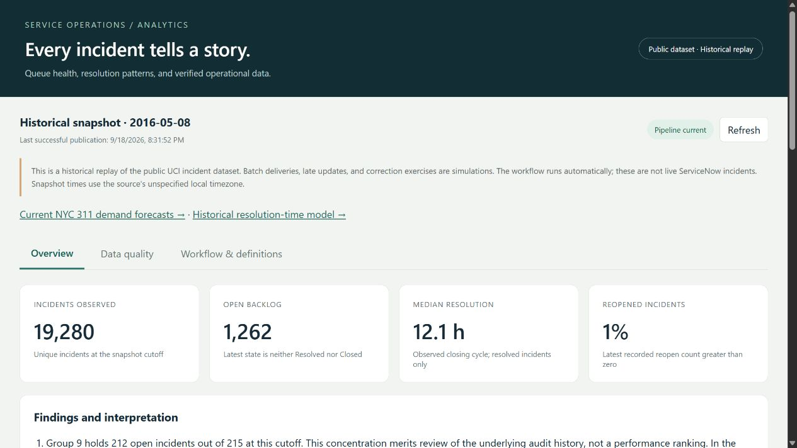
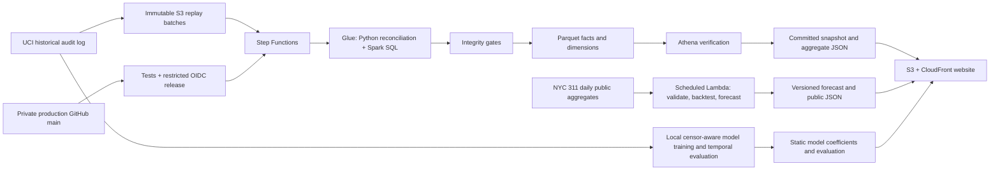

# Service Operations Analytics

Three connected demonstrations: verified IT incident analytics, daily NYC 311 demand forecasts, and an interactive historical resolution-time model.

**[IT dashboard](https://d17q1whdf7htno.cloudfront.net/) · [Current NYC 311 forecasts](https://d17q1whdf7htno.cloudfront.net/forecast/index.html) · [Resolution model](https://d17q1whdf7htno.cloudfront.net/resolution/index.html)**





The IT source is the public UCI Incident Management Process Enriched Event Log. **Deliveries, duplicates, late updates, and corrections are simulated from a fixed 2016 dataset.** NYC 311 is a separate current public source refreshed daily, with a reporting lag. Neither source is a live ServiceNow connection or a continuous event stream.

## Findings

These observations refer to the **May 8, 2016** replay snapshot; the scheduled dashboard can advance beyond it. [Reproducible analysis and caveats](docs/findings.md).

1. Group 9 has 212 open incidents out of 215 at this cutoff. Later source observations show all 215 reaching a terminal state, and only 68 retaining Group 9 as their final group. The cutoff and changing ownership matter; this is not evidence of team performance.
2. Unknown ownership contains 2,203 incidents, including 1,834 with recorded reassignments. Of these incidents, 1,797 initially had named groups. A missing current group and a historical reassignment counter measure different things.
3. The observed resolution median is 12.08 hours, while the 90th percentile is 292.12 hours. The long tail matters, and these resolved-case durations exclude open incidents.
4. Five invalid deliveries were quarantined out of 105,372 consumed deliveries. Integrity checks reconcile incident counts, keys, history intervals, flows, and independent SQL aggregates before publication.

## Models and measured results

The NYC pipeline compares same-weekday-last-week, four-week weekday means, and seasonal regression using chronological selection, calibration, and test windows. The September 20 publication covers data through September 18; its citywide selected baseline has 4.46% test WAPE. Results change as the rolling window advances. Visitors can compare boroughs, horizons, uncertainty bands, and an illustrative capacity threshold.

The historical resolution model retains censored cases, splits incidents by time, and compares pooled and priority Kaplan–Meier baselines with a piecewise hazard model. On 3,496 later test incidents, mean censor-adjusted Brier score improves from 0.27417 to 0.26013 (about 5.1%). **Observed-event median MAE does not beat the pooled baseline: 47.71 vs 47.25 hours.** The page exposes priority-level errors and limitations. Inputs remain in the browser; there is no paid inference endpoint.

## Automation and cost

Historical replay runs weekly; NYC forecasts refresh daily at 18:00 UTC. Service roles continue working after an administrator signs out. Failed validation preserves the last published report, and alarms monitor failures and freshness. The $25 budget is an alert threshold, not a hard spending cap.

This public repository starts from a clean publication history. The original production repository remains private and retains its restricted OIDC deployment. Public CI runs tests; deployment requires explicit configuration. The NYC scheduled runtime is deployed, while automatic GitHub releases for that extension remain disabled pending a separate scoped role update.

## Run locally

Python 3.11 or newer:

```powershell
python -m venv .venv
.\.venv\Scripts\python -m pip install -e ".[dev,aws,ml]"
.\.venv\Scripts\serviceops download
.\.venv\Scripts\python scripts/replay.py --as-of "2016-05-01 23:59:59"
.\.venv\Scripts\python scripts/serve_dashboard.py --port 8765
```

Open http://127.0.0.1:8765. The generated HTML also opens offline. On Windows, `./scripts/start-local.ps1` performs these steps after environment setup. Use a new output directory for an earlier historical cutoff.

```powershell
.\.venv\Scripts\python scripts/replay.py --as-of "2016-05-08 23:59:59"
.\.venv\Scripts\python scripts/exercise_batches.py
.\.venv\Scripts\python -m pytest
.\.venv\Scripts\python -m ruff check src tests scripts aws
.\.venv\Scripts\cfn-lint infrastructure/*.yaml
```

To generate the additional experiments after downloading the source:

```powershell
./.venv/Scripts/python scripts/forecast.py
./.venv/Scripts/python scripts/train_resolution.py
./.venv/Scripts/python scripts/serve_dashboard.py
```

Open http://127.0.0.1:8768. The server binds only to localhost and serves all three pages, using the generated reports. Forecast generation needs internet access; the historical model trains locally.

## Documentation

- [NYC 311 forecast](docs/nyc311-forecast.md): source coverage, evaluation, scheduling, and failure behavior.
- [Resolution model](docs/resolution-model.md): censoring, leakage prevention, baselines, evaluation, and inference.
- [Findings](docs/findings.md): interpretation and reproducible evidence.
- [Project guide](docs/project-guide.md): architecture, flow, processing choices, and boundaries.
- [Data contract and metrics](docs/data-contract.md): cleaning rules, table grains, and precise definitions.
- [Operations runbook](docs/runbook.md): deployment, recovery, scheduling, and custom domains.
- [Validation record](docs/validation.md): measured checks and evidence.
- [Cost measurement](docs/costs.md): observed compute usage and explicit monthly assumptions.
- [Forecast feasibility](docs/forecast-feasibility.md): temporal coverage and baseline evaluation.

## Boundaries

Ingestion is incremental: only unprocessed deliveries are read and normalized. Reconciled state and serving marts are rebuilt for each snapshot. The in-memory history has an explicit 500,000-version limit. This is a bounded portfolio workload, not an enterprise-scale CDC or exactly-once system. Spark writes Parquet and performs dimensional SQL joins; Python performs bounded reconciliation and time-aware metrics.

Replay eventually exhausts the fixed extract. The site stays online and displays that status. New authorized batches can be registered with `scripts/submit_batch.py`; a genuine live feed requires a separate source integration.

## Attribution

Amaral, C., Fantinato, M., & Peres, S. (2018). *Incident management process enriched event log*. [UCI Machine Learning Repository](https://doi.org/10.24432/C57S4H), [CC BY 4.0](https://creativecommons.org/licenses/by/4.0/). Transformations clean, quarantine, version, and aggregate the original observations. Raw files are excluded from Git.
